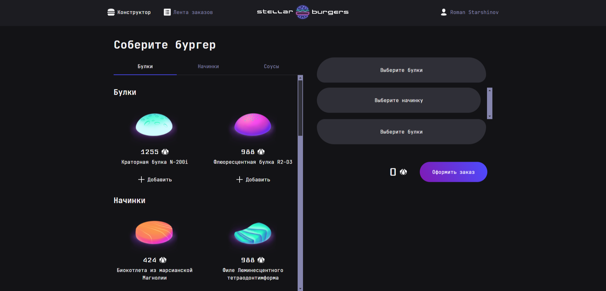

# 🌟 Stellar Burgers

## 🧾 Описание проекта

**Stellar Burgers** — это интерактивное веб-приложение для сборки бургеров в космическом стиле. Разработан в рамках обучения с целью практики технологий: **React**, **Redux Toolkit**, **TypeScript**, **WebSocket** и других.

### 🔧 Реализованный функционал:

- Аутентификация: регистрация, логин, восстановление пароля
- Просмотр заказов в реальном времени через WebSocket
- Личный кабинет пользователя с историей заказов
- Защищённые маршруты (PrivateRoute)
- Поддержка модальных окон и вложенной маршрутизации

### 🛠️ Используемые технологии:

- React, React Router
- Redux Toolkit, Redux Thunk
- TypeScript
- WebSocket
- SCSS-модули
- Jest, React Testing Library, Cypress
- Webpack, ESLint, Prettier

## 📸 Примеры работы



## 💡 Выводы

> Благодаря проекту я:
- Освоил работу с глобальным состоянием в Redux Toolkit
- Разобрался в подключении WebSocket и подписках на события
- Научился структурировать React-приложения по фичам
- Настроил тестирование и сборку проекта

## ⚙️ Установка и запуск

- Склонируйте репозиторий.
- Установите зависимости с помощью команды

```bash
npm install
```

- Запустите проект с помощью

```bash
npm dev
```

## Системные требования
Для работы с проектом потребуется Node.js и любой современный браузер.
